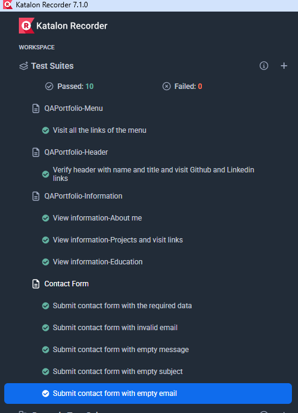

# Portfolio QA – MªÁngeles Cortés   
**Personal QA Projects Web Portfolio**  
🔗 [Ver Web Portfolio QA](https://cortessaavedram-tech.github.io/QAPortfolio/)

---

## 🛠 Tools used

---

## ⚙️ Main Features
- Responsive Navigation Menu
- Header with name, Professional Title and Social Links
- QA Projects Section with detailed description  
- Education Section
- Contact Form

---

## QA Tests
This Portfolio includes automated regression testing with **Katalon Studio (Selenium)** of all the main features. 

To execute the tests:
1. Download the Tests folder
2. Open the Chrome browser, search for, and install the Katalon Recorder (Selenium Tests) extension. [🔗 Extensiones Chrome](https://chromewebstore.google.com/ )
3. Open the Katalon Recorder extension and select the "Open test suite" Option. Open the downloaded tests folder.
4. Execute the tests by clicking on "Play all suites".

---

## 👩‍💻 Author
**MªÁngeles Cortés – QA Junior**  
[🔗 LinkedIn](https://www.linkedin.com/in/mariangelescortes/)

